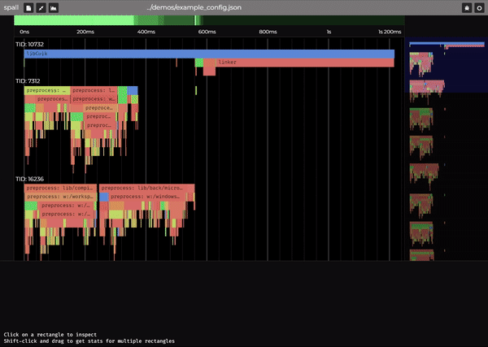

# spall

spall is a profiler library and a web-frontend for exploring your code and digging into potential performance problems.



## Features
- Zippy! spall can load 500 MB of .spall data into your browser in a second or two, and you can scroll and pan it at a glorious 165+ FPS
- Easy to Use! Single-header C library for instrumenting your code
- Numbers Galore! spall can collect a handful of very useful stats about your program without even breaking a sweat
- Light and Dark Modes! You can blow your eyes out in light mode, relish the sweet neon colors in dark mode, auto-switch with your system
- Velociraptors Included! Uhh, wait, sorry, we're all out. No velociraptors here. You can pretend though.

## Usage

spall includes a small single-header C library, `spall.h`.

spall currently supports 2 different file formats:
- .json, in Google's trace format used by `perfetto`, `chrome://tracing`, and `speedscope`, described below
- .spall, our custom binary format

You can either instrument your code with our header, or use your existing `chrome://tracing` compatible JSON dumping code.

If you're starting from scratch, you probably want to use the spall header to generate events. The binary format has much lower
profiling overhead (so your traces should be more accurate), and ingests around 10x faster than the JSON format.


## JSON Traces 
If you want to use JSON, spall expects events following [Google's JSON trace format](https://docs.google.com/document/d/1CvAClvFfyA5R-PhYUmn5OOQtYMH4h6I0nSsKchNAySU/preview)
They look like this:
```
[
	{"cat":"function", "name":"main", "ph": "X", "pid": 0, "tid": 0, "ts": 0, "dur": 1},
	{"cat":"function", "name":"myfunction", "ph": "B", "pid": 0, "tid": 0, "ts": 0},
	{"cat":"function", "ph": "E", "pid": 0, "tid": 0, "ts": 0}
]
```
(spall doesn't care about trailing commas and close brackets are not required, to ease file creation / event streaming)

### Field Types

`cat` - Category of event. Currently unused

`name` - the name of the event, a string

`ph` - The type of event
|    Type    | Symbol  |
|------------|----------|
|    Begin   |   "B"   |
|    End     |   "E"   |
| Complete   |   "X"   |

`tid` - thread id, u32
`pid` - process id, u32

All tids and pids must be between 0 and u32_MAX, as whole values

`ts`  - timestamp, a double, in microseconds
`dur` - timestamp, a double, in microseconds

(A timestamp of 1 starts at 1 μs)

## Event Types

Spall currently supports only Begin, End, and Complete events

### Complete
```
{"cat":"function", "name":"foo", "ph": "X", "pid": 0, "tid": 0, "ts": 0, "dur": 1},
```
Complete events require a duration field, because they track a function's start/end all in one

### Begin
```
{"cat":"function", "name":"myfunction", "ph": "B", "pid": 0, "tid": 0, "ts": 0},
```

### End
```
{"cat":"function", "ph": "E", "pid": 0, "tid": 0, "ts": 0},
```
End events automatically close the most recent begin event with the same pid and tid, so they don't need names

## Important Notes

Regardless of ingest format, all begin and end events within a process/thread (pid/tid) are expected to be in earliest timestamp first, sorted order
ex:
```
[
	{"cat":"function", "name":"main", "ph": "B", "pid": 0, "tid": 0, "ts": 0},
	{"cat":"function", "name":"foo", "ph": "B", "pid": 0, "tid": 0, "ts": 1},
	{"cat":"function", "ph": "E", "pid": 0, "tid": 0, "ts": 2},
	{"cat":"function", "ph": "E", "pid": 0, "tid": 0, "ts": 3}
]
```
