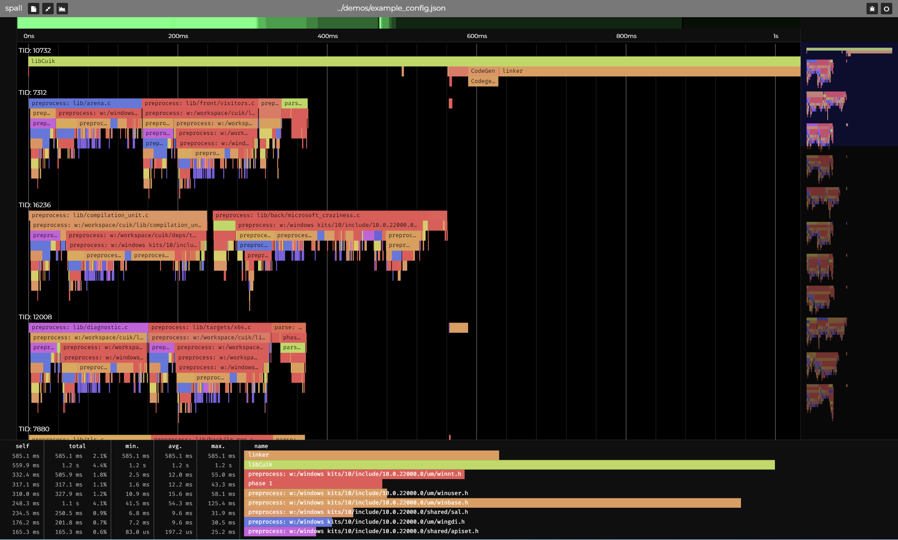

# spall

spall ingests trace data and renders it as a navigatable flamegraph



spall currently supports 2 different file formats:
- JSON-ish, in Google's trace format 
- .spall, a custom format described below

## JSON Traces 
Spall takes events formatted with [Google's JSON trace format](https://docs.google.com/document/d/1CvAClvFfyA5R-PhYUmn5OOQtYMH4h6I0nSsKchNAySU/preview)
They look like this:
```
[
	{"cat":"function", "name":"main", "ph": "X", "pid": 0, "tid": 0, "ts": 0, "dur": 1},
	{"cat":"function", "name":"myfunction", "ph": "B", "pid": 0, "tid": 0, "ts": 0},
	{"cat":"function", "ph": "E", "pid": 0, "tid": 0, "ts": 0}
]
```
(spall doesn't care about trailing commas and close brackets are not required, to ease file creation / event streaming)

### Field Types

`cat` - Category of event. Currently unused

`name` - the name of the event, a string

`ph` - The type of event
|    Type    | Symbol  |
|------------|----------|
|    Begin   |   "B"   |
|    End     |   "E"   |
| Complete   |   "X"   |

`tid` - thread id, u32
`pid` - process id, u32

All tids and pids must be between 0 and u32_MAX, as whole values

`ts`  - timestamp, a double, in microseconds
`dur` - timestamp, a double, in microseconds

(A timestamp of 1 starts at 1 μs)

## Event Types

Spall currently supports only Begin, End, and Complete events

### Complete
```
{"cat":"function", "name":"foo", "ph": "X", "pid": 0, "tid": 0, "ts": 0, "dur": 1},
```
Complete events require a duration field, because they track a function's start/end all in one

### Begin
```
{"cat":"function", "name":"myfunction", "ph": "B", "pid": 0, "tid": 0, "ts": 0},
```

### End
```
{"cat":"function", "ph": "E", "pid": 0, "tid": 0, "ts": 0},
```
End events automatically close the most recent begin event with the same pid and tid, so they don't need names


## Spall Traces
```Odin
BinEventType :: enum u8 {
	Begin = 0,
	End   = 1,
}

BinHeader :: struct #packed {
	magic: u64,          // Expected to be 0x0BADFOOD
	version: u64,        // Currently version 0
	timestamp_unit: f64, // 1 is 1 microsecond
}

BeginEvent :: struct #packed {
	type: BinEventType,
	pid: u32,
	tid: u32,
	time: f64,
	name_len: u8,       // if the name is a 0-terminated string, the len must include the 0

	// The name of the event must follow immediately after the begin event struct
}

EndEvent :: struct #packed {
	type: BinEventType,
	pid: u32,
	tid: u32,
	time: f64,
}
```

The binary format is *fairly* close to the JSON format. A spall file contains a small header, and events.
All values should be in little endian.

A valid file is structured roughly like this:
```
BinHeader

BeginEvent
event_name
EndEvent
...
```

## Important Notes

Regardless of ingest format, all begin and end events within a thread (tid) are expected to be in earliest timestamp first, sorted order
ex:
```
[
	{"cat":"function", "name":"main", "ph": "B", "pid": 0, "tid": 0, "ts": 0},
	{"cat":"function", "name":"foo", "ph": "B", "pid": 0, "tid": 0, "ts": 1},
	{"cat":"function", "ph": "E", "pid": 0, "tid": 0, "ts": 2},
	{"cat":"function", "ph": "E", "pid": 0, "tid": 0, "ts": 3}
]
```
Complete events can be unsorted
